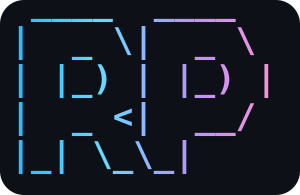

# repo-pattern

<p align="center">

<br>


</p>

**Set up a minimal, project-local Claude Code workspace.**

`repo-pattern` initializes or migrates a project with a selected MCP profile,
an optional ECC or gstack workflow, and gitignored machine-local configuration.
It preserves an existing root `CLAUDE.md` and keeps managed setup state isolated
from application source files.

## Why use it?

* **Start fast** — create `.claude/`, `.mcp.json`, and repo-pattern state.
* **Choose your workflow** — use ECC, gstack, both, or only base metadata.
* **Use focused MCP profiles** — `web`, `backend`, `research`, `full`, or interactive `custom`.
* **Keep local setup local** — generated configuration and credentials are gitignored.
* **Migrate deliberately** — inspect with `audit`, take over with `setup --migrate`, and verify with `doctor`.

## Install

```bash
npm install -g @negikirin/repo-pattern
```

## Quick start

After installing, run interactive setup:

```bash
repo-pattern setup
```

For scriptable setup:

```bash
repo-pattern setup --profile web --setup-pipeline ecc --yes
repo-pattern setup --profile web --setup-pipeline gstack --yes
repo-pattern setup --profile web --setup-pipeline gstack --with-rules --yes
repo-pattern setup --profile web --setup-pipeline none --with-rules --yes
```

Pipeline scope is explicit:

- `ecc` (default) — project-scoped ECC.
- `gstack` — project-local gstack at `.claude/skills/gstack`.
- `both` — project-scoped ECC plus project-local gstack.
- `none` — base project metadata only.

gstack requires Git and Bun v1.0+ on `PATH`. repo-pattern never downloads Bun and never runs the upstream `gstack/setup` script. It keeps the checkout in `.claude/skills/gstack`, runtime state in `.repo-pattern/gstack/`, and both locations gitignored. A valid existing local checkout is reused unchanged; a valid global checkout is migration-only input copied to the target without modification. Bootstrap materializes required review support files beside generated wrappers from that project-local checkout. Optional plan-tune hooks are merged only into target `.claude/settings.json`.

ECC rules are independent of the ECC plugin. Whenever rules are applied, repo-pattern atomically replaces `.claude/agents/` with ECC's upstream `agents/**` tree and records the source revision plus a SHA-256 file manifest only in `.repo-pattern/.repo-pattern.lock.json`. `ecc` and `both` install auto-detected packs by default; the interactive wizard can switch to manual packs or none. `gstack` and `none` prompt whether to install rules, while scriptable setup requires `--with-rules`. Managed packs live in `.claude/rules/ecc/`; ECC skills are never copied. `doctor` verifies agent provenance and manifest integrity.

Migrate an existing project:

```bash
repo-pattern audit
repo-pattern setup --profile web --migrate --yes
repo-pattern doctor
```

## Commands

| Command | Purpose |
|----|----|
| `repo-pattern help` | Show CLI help. |
| `repo-pattern setup` | Initialize or migrate a Claude Code setup. |
| `repo-pattern audit` | Inspect current Claude Code/ECC state. |
| `repo-pattern doctor` | Validate the generated setup. |
| `repo-pattern mcp --profile web` | Regenerate `.mcp.json` from an MCP profile. |
| `repo-pattern rules` | Apply or refresh project-local ECC rules. |
| `repo-pattern cleanup` | Archive old local Claude runtime surfaces. |
| `repo-pattern ecc` | Run or attempt ECC setup manually. |

Common options:

```bash
--target /path/to/project  # default: current directory
--profile web              # choose an MCP profile
--setup-pipeline ecc        # ecc (default), gstack, both, or none
--with-plan-tune-hooks     # add gstack hooks; requires gstack or both
--with-rules               # install auto-detected .claude/rules/ecc on gstack or none
                            # ecc and both install auto-detected rules by default
--with-skill ui-ux-pro-max # optional UI/UX skill; requires Python 3.x
--with-skills nextjs-pattern,fastapi-pattern # optional framework pattern skills
--migrate                  # take over legacy/local Claude runtime surfaces
--force                    # reapply setup over repo-pattern-managed state
--dry-run                  # preview mutating commands
--yes                      # non-interactive setup
```

## MCP profiles

| Profile | Use when |
|----|----|
| `web` | You build web apps and want browser/docs helpers. |
| `backend` | You focus on server-side projects. |
| `research` | You need search and extraction tooling. |
| `full` | You want every approved MCP server enabled. |
| `custom` | You want to choose exact MCP servers interactively; not available with `--yes`. |

`setup` selects `web` for detected frontend, full-stack, and Node projects; other projects default to `backend`.

When selected, Context7 and Tavily prompts include dashboard links for getting API keys.

## What it creates

```text
target-project/
├── CLAUDE.md                     # created empty if missing
├── .claude/
│   ├── CLAUDE.md
│   ├── settings.json             # copied from example, gitignored
│   ├── settings.local.json       # when local settings are provided, gitignored
│   ├── hooks/
│   │   └── remove-generated-attribution.mjs
│   │                               # when the managed attribution hook is enabled
│   ├── rules/ecc/                # when ECC rules are applied, gitignored
│   ├── agents/                   # when ECC rules are applied, gitignored
│   └── skills/
│       ├── gstack/               # gstack/both pipeline, gitignored
│       └── review/               # generated gstack wrappers/support, gitignored
├── .mcp.json                     # generated, gitignored
├── .repo-pattern/
│   ├── .gitignore               # *
│   ├── gstack/                  # gstack runtime state when selected
│   ├── .repo-pattern.json
│   └── .repo-pattern.lock.json
```

`repo-pattern` preserves an existing root `CLAUDE.md` and keeps machine-local values out of git.

`.claude/settings.json` is generated from the tracked shared-settings template. It owns Claude Code permissions, MCP approvals, hooks, and commit/PR attribution. `.claude/settings.local.json` is generated from the local-settings template. It owns provider values plus selected plugin and marketplace entries; it never owns attribution.

Each full `repo-pattern setup` run reconciles repo-pattern-managed state to its current pipeline, rule, and optional-skill selection. It removes deselected managed plugins, marketplaces, local skills, and ECC rules, while preserving provider credentials, unrelated local settings, and unknown third-party plugins or marketplaces. The initialized-project **Add optional skills** action remains additive.

## Safety defaults

* `.mcp.json` is gitignored because it may contain local values.
* `.repo-pattern/.repo-pattern.json` is generated from `.repo-pattern.example.json` and kept inside `.repo-pattern/`.
* `.claude/` is generated from `.claude.example/` and gitignored.
* Basic OS/IDE noise (`.DS_Store`, `Thumbs.db`, `.vscode/`, `.idea/`) is gitignored during setup.
* `.claude/settings.json` disables commit attribution by default; interactive setup can turn it on or use a custom trailer. When managed attribution cleanup is enabled, it registers the generated-attribution hook without replacing unrelated hooks.
* ECC rule application atomically replaces repo-pattern-managed `.claude/rules/ecc/` and `.claude/agents/` from upstream ECC sources, with rollback through nested repo-pattern metadata writes. The lock records the source revision and SHA-256 inventory; ECC skills, commands, hooks, scripts, and `.agents` are never copied. Clearing ECC rules clears only agent metadata and retains `.claude/agents/`.
* Karpathy-inspired Claude Code guidelines are included in `.claude/CLAUDE.md` from `multica-ai/andrej-karpathy-skills` (MIT).
* Optional external skills are user opt-in only: `--with-skill taste`, `--with-skill document-specialist`, `--with-skill ui-ux-pro-max`, `--with-skill impeccable`, `--with-skill huashu-design`, `--with-skill nextjs-pattern`, `--with-skill fastapi-pattern`, `--with-skill herdr`, or interactive setup.

## External guidance and skills

| Name | Integrated as | Source | License |
|----|----|----|----|
| `karpathy-guidelines` | Built-in `.claude/CLAUDE.md` guidance | https://github.com/multica-ai/andrej-karpathy-skills | MIT |
| `gstack` | Project-local checkout via `--setup-pipeline gstack` | https://github.com/garrytan/gstack | MIT |
| `taste` | Optional Claude Code plugin via `--with-skill taste` | https://github.com/Leonxlnx/taste-skill/ | MIT |
| `document-specialist` | Optional `.claude/skills/` install via `--with-skill document-specialist` | https://github.com/SpillwaveSolutions/document-specialist-skill/ | NOASSERTION — no upstream license declared during review on 2026-07-06 |
| `ui-ux-pro-max` | Optional Claude Code plugin via `--with-skill ui-ux-pro-max` | https://github.com/nextlevelbuilder/ui-ux-pro-max-skill/ | MIT |
| `impeccable` | Optional Claude Code plugin via `--with-skill impeccable` | https://github.com/pbakaus/impeccable/ | Apache-2.0 |
| `huashu-design` | Optional `.claude/skills/` install via `--with-skill huashu-design` (multimedia scripts may need Playwright/Python/ffmpeg; install can take \~10 minutes, so opt in deliberately) | https://github.com/alchaincyf/huashu-design/ | MIT |
| `nextjs-pattern` | Optional `.claude/skills/` install via `--with-skill nextjs-pattern` | https://github.com/NegiKirin/nextjs-pattern/ | MIT |
| `fastapi-pattern` | Optional `.claude/skills/` install via `--with-skill fastapi-pattern` | https://github.com/NegiKirin/fastapi-pattern/ | MIT |
| `herdr` | Optional `.claude/skills/` install via `--with-skill herdr`; control commands require `HERDR_ENV=1` inside Herdr | https://github.com/ogulcancelik/herdr/ | AGPL-3.0-or-later or commercial |

## Learn more

Full setup details live in [docs/repo-pattern/setup-guide.md](docs/repo-pattern/setup-guide.md).
Third-party license notices are listed in [THIRD_PARTY_NOTICES.md](THIRD_PARTY_NOTICES.md).

From a source checkout, replace `repo-pattern` with:

```bash
node scripts/repo-pattern.mjs
```


