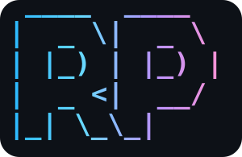

# repo-pattern

<p align="center">

<br>


</p>

**Set up a minimal, project-local Claude Code workspace.**

`repo-pattern` initializes or migrates a project with explicitly selected MCP servers, an optional ECC or gstack workflow, and gitignored machine-local configuration. It preserves an existing root `CLAUDE.md` and keeps managed setup state isolated from application source files.

## Quick start

```bash
npm install -g @negikirin/repo-pattern
repo-pattern setup
```

Interactive setup uses one Ink + React wizard. It starts with the Core MCP servers selected, groups MCP servers and optional skills for easier scanning, and allows an empty MCP selection. It prompts only for values required by the selected server definitions.

For scripts and CI, `--yes` defaults to Context7, Tavily, and GitNexus when no `--mcp` is supplied:

```bash
repo-pattern setup --target /path/to/project --yes
```

Use repeatable `--mcp` to choose an explicit ordered set. Repeated names are ignored after their first occurrence.

```bash
repo-pattern setup --target /path/to/project \
  --mcp context7 --mcp playwright --mcp shadcn-studio \
  --setup-pipeline ecc --yes
```

Migrate an existing project deliberately:

```bash
repo-pattern audit
repo-pattern setup --mcp context7 --mcp tavily --mcp gitnexus --migrate --yes
repo-pattern doctor
```

## Commands

| Command | Purpose |
|---|---|
| `repo-pattern setup` | Initialize or migrate a Claude Code setup. |
| `repo-pattern mcp --mcp <name>` | Regenerate `.mcp.json` from explicitly selected servers. |
| `repo-pattern audit` | Inspect current Claude Code/ECC state. |
| `repo-pattern doctor` | Validate the generated setup. |
| `repo-pattern rules` | Apply or refresh project-local ECC rules. |
| `repo-pattern cleanup` | Archive old local Claude runtime surfaces. |

Common options:

```bash
--target /path/to/project
--mcp context7             # repeat for each selected server
--setup-pipeline ecc       # ecc (default), gstack, both, or none
--with-plan-tune-hooks     # requires gstack or both
--with-rules               # install auto-detected ECC rules for gstack or none
--with-skill ui-ux-pro-max
--with-skills nextjs-pattern,fastapi-pattern
--migrate
--force
--dry-run
--yes
```

## MCP servers

Interactive server groups:

- **Core / Must have:** `context7`, `tavily`, `gitnexus`
- **Development tools:** `chrome-devtools`, `playwright`
- **UI / shadcn:** `shadcn`, `shadcn-studio`

| MCP server | Description |
|---|---|
| `chrome-devtools` | Debug frontend runtime behavior, console, network, and performance. |
| `context7` | Look up current documentation. Requires `CONTEXT7_API_KEY`. |
| `gitnexus` | Explore the code knowledge graph, assess change impact, and trace flows. |
| `playwright` | Automate browser interaction and end-to-end testing. |
| `shadcn` | Browse shadcn/ui components and generate UI. |
| `shadcn-studio` | Use shadcn/ui Studio component design and generation. |
| `tavily` | Search the web and extract content. Requires `TAVILY_API_KEY`. |

`CONTEXT7_API_KEY` and `TAVILY_API_KEY` are stored only in gitignored `.mcp.json`. `ANTHROPIC_AUTH_TOKEN` remains in gitignored `.claude/settings.local.json` and is never substituted into MCP configuration or setup locks.

## What it creates

```text
target-project/
├── CLAUDE.md                     # created empty if missing
├── .claude/
│   ├── CLAUDE.md
│   ├── settings.json             # generated, gitignored
│   ├── settings.local.json       # local provider settings, gitignored
│   ├── hooks/remove-generated-attribution.mjs
│   ├── rules/ecc/                # when ECC rules are applied
│   ├── agents/                   # when ECC rules are applied
│   └── skills/                   # selected local skills and gstack
├── .mcp.json                     # generated, gitignored
└── .repo-pattern/
    ├── .gitignore
    ├── .repo-pattern.json
    └── .repo-pattern.lock.json
```

## Safety defaults

- `.claude/`, `.mcp.json`, and `.repo-pattern` state are generated locally and gitignored.
- Existing root `CLAUDE.md` is preserved.
- Basic OS/IDE noise is added to `.gitignore` during setup.
- ECC rule application atomically replaces only repo-pattern-managed `.claude/rules/ecc/` and `.claude/agents/`.
- Optional external skills are opt-in through `--with-skill`, `--with-skills`, or interactive setup.
- gstack requires Git and Bun v1.0+ on `PATH`; repo-pattern never downloads Bun or runs upstream `gstack/setup`.

## Learn more

Full setup details live in [docs/repo-pattern/setup-guide.md](docs/repo-pattern/setup-guide.md). Third-party license notices are listed in [THIRD_PARTY_NOTICES.md](THIRD_PARTY_NOTICES.md).
